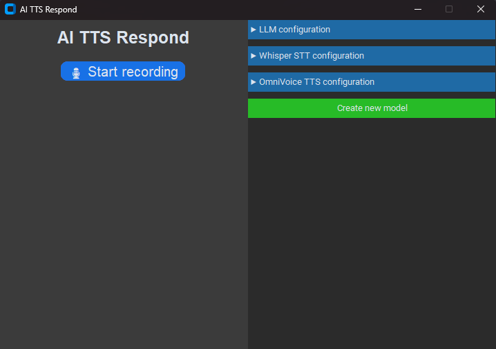
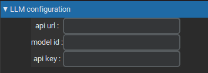
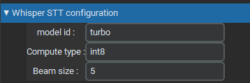

# AI-TTS-Respond V1

## Install AI TTS Respond

**Step 1**: Install PyTorch

Choose **one** of the following methods: **pip**

<details>
<summary>NVIDIA GPU</summary>

```bash
# Install pytorch with your CUDA version, e.g.
pip install torch==2.8.0+cu128 torchaudio==2.8.0+cu128 --extra-index-url https://download.pytorch.org/whl/cu128
```
> See [PyTorch official site](https://pytorch.org/get-started/locally/) for other versions installation.

</details>

<details>
<summary>CPU</summary>

```bash
pip install torch==2.8.0 torchaudio==2.8.0
```
</details>

**Step 2**: Download AI TTS Respond

```bash
git clone https://github.com/Spacetrale/AI-TTS-Respond.git
cd AI-TTS-Respond
python -m venv ai-tts-respond
./ai-tts-respond/Scripts/activate
pip install -r requirements.txt
```

**Step 3**: Run it

```bash
python main.py
```

## How use it

**Step 1**: Configure llm

<p align="center"></p>
Now you have installed AI TTS Respond but for use it you need to do some modification.

You need to open "LLM configuration" and you will see that
<p align="center"></p>

For the llm we will use OpenRouter.ai with free models so in "api url" you put "https://openrouter.ai/api/v1" (you can use others api or local api if you want)</br>
For the model id we need to go on https://openrouter.ai/models for search a model. We will use "google/gemma-4-26b-a4b-it:free" in this case</br>
And finally a api key, for this you need to create a account for access to this page "https://openrouter.ai/workspaces/default/keys"

When you are on it you need to click on "New Key", name it with what you want and after click on "Create". Now you have the api key, you need to copy it and paste in "api key" entry.

**Step 2**: Configure stt

<p align="center"></p>
Great now you have finish to configure the LLM, and you can use AI TTS Respond without config STT and TTS because they have already default config.

**Step 3**: Configure tts
