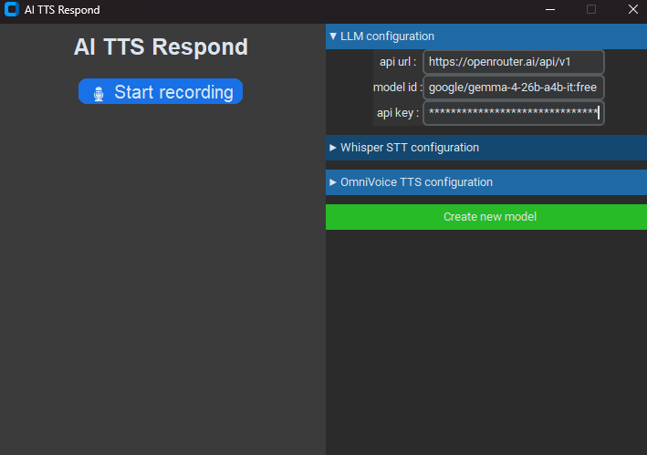
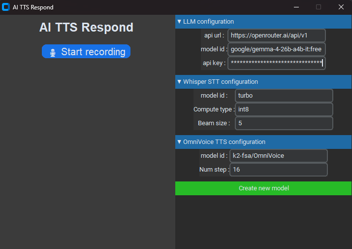
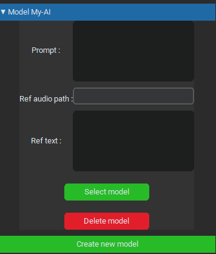
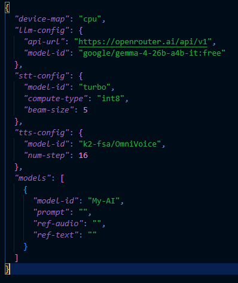

# AI-TTS-Respond V1

## Install AI TTS Respond

**Step 1**: Install PyTorch

Choose **one** of the following methods: **pip**

<details>
<summary>NVIDIA GPU</summary>

```bash
# Install pytorch with your CUDA version, e.g.
pip install torch==2.8.0+cu128 torchaudio==2.8.0+cu128 --extra-index-url https://download.pytorch.org/whl/cu128
```
> See [PyTorch official site](https://pytorch.org/get-started/locally/) for other versions installation.

</details>

<details>
<summary>CPU</summary>

```bash
pip install torch==2.8.0 torchaudio==2.8.0
```
</details>

**Step 2**: Download AI TTS Respond

```bash
git clone https://github.com/Spacetrale/AI-TTS-Respond.git
cd AI-TTS-Respond
python -m venv ai-tts-respond
./ai-tts-respond/Scripts/activate
pip install -r requirements.txt
```

**Step 3**: Run it

```bash
python main.py
```

## How use it

**Step 1**: Configure LLM.

<p align="center"></p>
Now you have installed AI TTS Respond but for use it you need to do some modification.

You need to open "LLM configuration" and you will see that.
<p align="center"></p>

For the LLM we will use OpenRouter.ai with free models so in "api url" you put "https://openrouter.ai/api/v1" (you can use others api or local api if you want).</br>
For the model id we need to go on https://openrouter.ai/models for search a model. We will use "google/gemma-4-26b-a4b-it:free" in this case.</br>
And finally a api key, for this you need to create a account for access to this page "https://openrouter.ai/workspaces/default/keys".

When you are on it you need to click on "New Key", name it with what you want and after click on "Create". Now you have the api key, you need to copy it and paste in "api key" entry.

**Step 2**: Configure STT.

<p align="center"></p>
Great now you have finish to configure the LLM, and you can use AI TTS Respond without config STT and TTS because they have already default config.

For the model you can use one of these:
```
tiny, tiny.en, base, base.en, small, small.en, medium, medium.en, large-v1, large-v2, large-v3, turbo
```

**Large-v3** provide better results but its slower than **turbo** or others.

For the compute type we can use one these:
```
int8, float16, float32
```

For beam size, more you put, more is slower.

**Step 3**: Configure TTS.

If you want a better results augment the num step, but it will more slow.

**Step 4**: Configure you own model.

<p align="center"></p>
Now you can create your first model!<br>
For that click on "Create new model" it will open a new popup that require the name of the model, name it with what you want and click on "Ok".

In the right you will have the model you create showed, click on it and that will show that:
<p align="center"></p>

You can put what you want in the prompt, like if you want create a anime character like Rem from Re:ZERO, You can do it with a good prompt!<br>
The "ref audio" is required else its won't work, so put the audio path of the voice you want to clone.<br>
The "ref text" is the text say by the voice in the "ref audio" you don't need to put anything in because that will automaticly generated by OmniVoice.

Now click on "Select model" it will show one popup, but don't record now you need to wait the second popup that say "Model loaded" for record!

When you click on record it will be red and show "🎙️ Stop recording" that say you are recording your voice for talking to the model.<br>
When you finish to talk click on "🎙️ Stop recording" and now be patient because that can take some time for generate a output audio. (1 min or more!)

**Step CUDA users**: Manual activate CUDA

Actually the script use only cpu, for change that you need to go in the data.json. (Stop the program before!)

<p align="center"></p>
In the line 2 we have the "device-map", that exactly what we need to change!<br>
In default the "device-map" is set to "cpu" but if you want to use CUDA for better performance you need to replace it by "cuda:0" for use CUDA.<br>
Now you can use your graphic card for better performance!!
